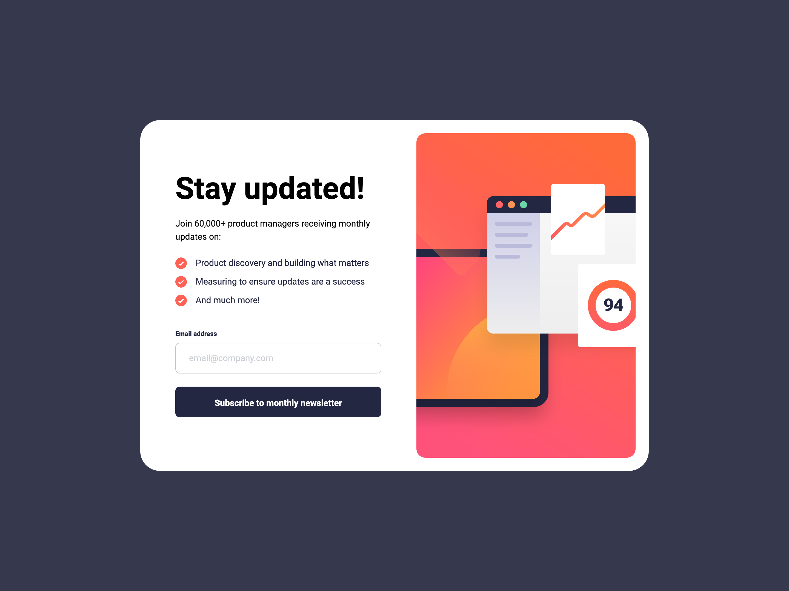
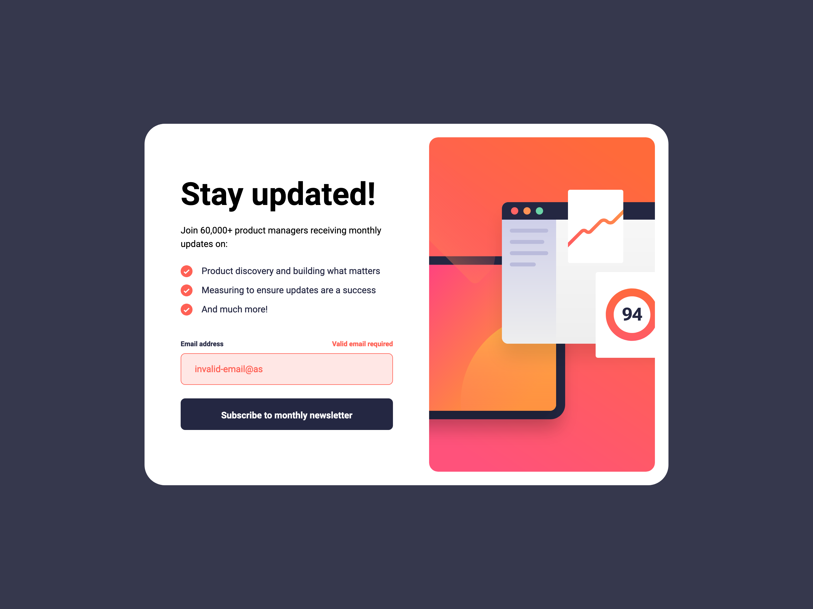
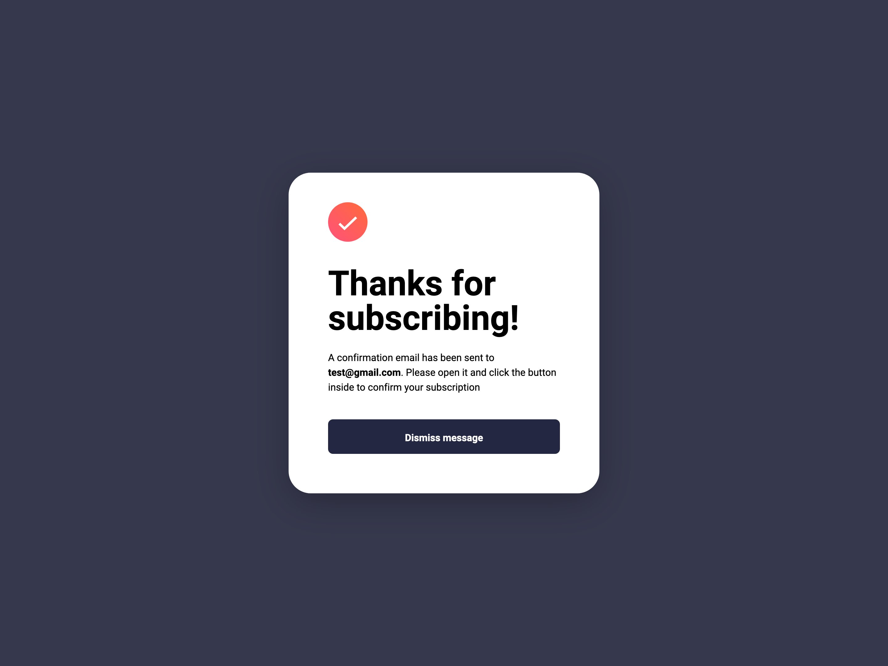
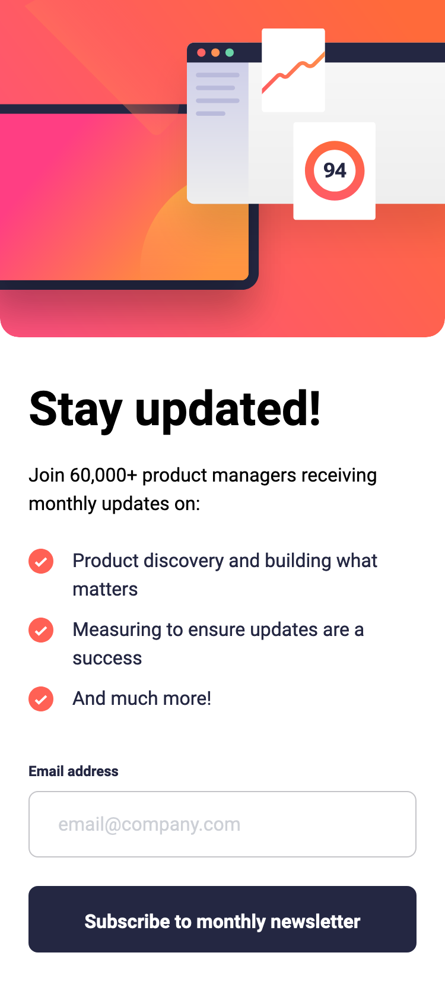
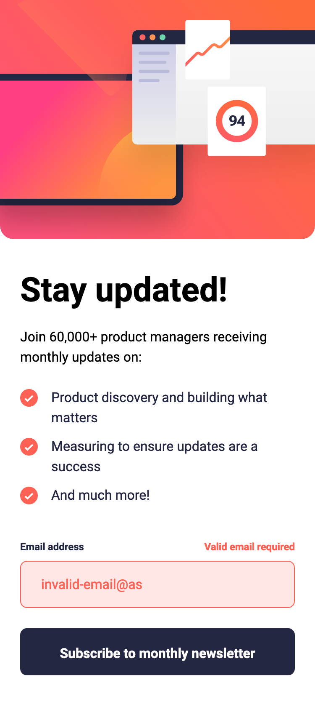
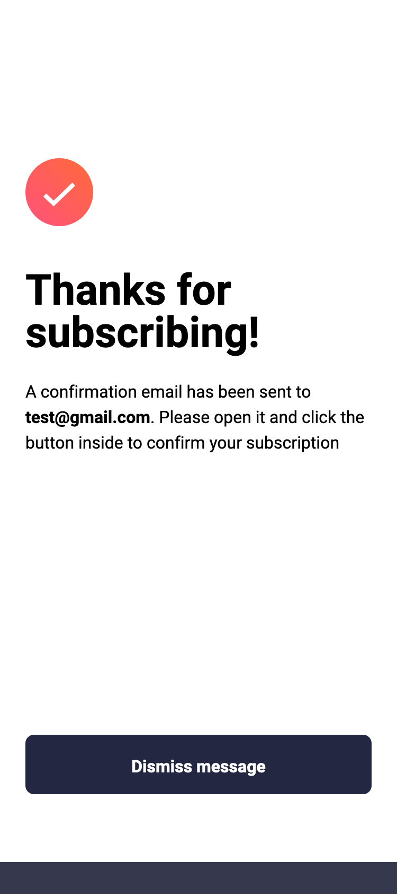

# Frontend Mentor - Newsletter signup form with success message solution

This is a solution to the [Newsletter signup form with success message challenge on Frontend Mentor](https://www.frontendmentor.io/challenges/newsletter-signup-form-with-success-message-3FC1AZbNrv). Frontend Mentor challenges help you improve your coding skills by building realistic projects.

## Table of contents

- [Overview](#overview)
  - [The challenge](#the-challenge)
  - [Screenshot](#screenshot)
  - [Links](#links)
- [Getting Started](#getting-started)
  - [Prerequisites](#prerequisites)
  - [Installation](#installation)
- [My process](#my-process)
  - [Built with](#built-with)
  - [What I learned](#what-i-learned)
  - [Continued development](#continued-development)
  - [Useful resources](#useful-resources)
- [Author](#author)

## Overview

### The challenge

Users should be able to:

- Add their email and submit the form
- See a success message with their email after successfully submitting the form
- See form validation messages if:
  - The field is left empty
  - The email address is not formatted correctly
- View the optimal layout for the interface depending on their device's screen size
- See hover and focus states for all interactive elements on the page

### Screenshot

<div style='display: flex; gap: 10px; margin-bottom: 20px'>



</div>
<div style="display: flex; gap: 20px;">



</div>

### Links

- Solution URL: https://www.frontendmentor.io/solutions/newsletter-form-with-nextjs-tailwind-typescript-storybook-vitest-UWrl1NrIdh
- Live Site URL: https://newsletter-sign-up-form-with-success-message-three-amber.vercel.app/

## Getting Started

To get a local copy up and running follow these simple steps:

### Prerequisites

Make sure you have the following software installed on your machine:

- [Node.js](https://nodejs.org/) (Node.js 18.17 or later)
- [pnpm](https://pnpm.io/)

### Installation

1. Clone the repository:

   ```sh
   git clone https://github.com/jaceleedev/newsletter-sign-up-form-with-success-message.git
   ```

2. Navigate to the project directory:

   ```sh
   cd newsletter-sign-up-form-with-success-message
   ```

3. Install dependencies using pnpm:

   ```sh
   pnpm install
   ```

4. Start the development server:

   ```sh
   pnpm dev
   ```

5. Open your browser and visit http://localhost:3000 to view the project.

6. To start Storybook, run the following command and access it at http://localhost:6006

   ```sh
   pnpm run storybook
   ```

7. To run tests, use the following command:

   ```sh
   pnpm run test
   ```

## My process

### Built with

- Next.js (v14.2.5)
- React.js (v18)
- TypeScript (v5)
- Tailwind CSS (v3.4.1)
- Storybook (v8.2.7)
- Vitest (v2.0.5)
- Semantic HTML5 markup
- CSS Grid, Flexbox
- SEO & web accessibility

### What I learned

This project was quite ambitious, and I learned several important concepts simultaneously, which took considerable time. Here's a summary of what I learned:

1. Understanding Storybook: I grasped the concept and usage of Storybook, a tool that allows component creation and testing in an environment independent of the actual application. The key point is its independence from the real UI. As the name suggests, Storybook enables defining various features and states of components as stories, facilitating sharing and collaboration. I found it similar to writing API documentation for backend development, but more practical as it allows direct component visualization in the browser. I consider it an essential tool for future frontend development.

2. Unit and Integration Testing: I learned how to perform unit and integration tests using Vitest and testing-library. While e2e testing wasn't necessary for this project, I realized that testing becomes increasingly crucial as projects grow, although it requires significant time and effort. For personal toy or side projects, I believe Storybook alone might suffice. However, unit tests for highly reusable components and integration tests for critical components like forms are beneficial, though challenging for developers new to testing. Therefore, I learned that testing should be approached flexibly based on project scale, team size, and schedule.

3. Benefits of Testing Tools: Using Storybook, Vitest, and testing-library made me more thoughtful about component creation, focusing on smaller, more focused functionalities. Without these tools, the components might have worked but would likely have been less reusable. I'm particularly pleased with the Button and Input components created this time, as writing test code helped me discover aspects I had overlooked during initial development.

4. Drawbacks of Testing Tools: I also noticed some disadvantages, particularly for solo side projects like Frontend Mentor challenges. These tools can be time-consuming, and the discrepancies between test and real environments can lead to unnecessary efforts. For side projects, where quickly building components and implementing business logic is crucial, extensive testing might not always be the best choice. It's more suited for large-scale projects with multiple developers collaborating.

5. Next.js Server Actions: Another significant aspect of this project was learning and implementing Next.js server actions. I focused on understanding and utilizing useFormState, useFormStatus, and server actions. Although this implementation differed slightly from the project's initial requirements, it allowed me to gain valuable experience with these new features. The emphasis was on learning and applying these advanced Next.js concepts, which I believe will be beneficial for future projects. This approach demonstrated the importance of adapting to new technologies and being flexible in implementation strategies.

These learnings have not only improved my technical skills but also given me a clearer direction for future growth and areas to focus on in upcoming projects.

### Continued development

In future projects, I want to continue focusing on and improving in these areas:

1. Storybook Integration: I plan to consistently use Storybook in future projects, recognizing its value in component development and documentation.

2. Selective Testing Approach: I'll consider project scale and schedule when deciding on the extent of testing. However, I'll maintain unit testing for highly reusable components to ensure their reliability and maintainability.

3. Embracing New Technologies: While learning new technologies takes time, I acknowledge that this investment is valuable when done effectively. I'm committed to continuing to challenge myself with new learning opportunities in future projects.

By focusing on these areas, I hope to continually improve my front-end development skills and create more efficient and sophisticated web applications.

### Useful resources

- [Next.js Documentation](https://nextjs.org/docs) - Comprehensive guide to Next.js features and API.
- [Tailwind CSS Documentation](https://tailwindcss.com/docs/installation) - Detailed documentation for Tailwind CSS.
- [Storybook Documentation](https://storybook.js.org/docs) - Official guide for building and testing UI components with Storybook.
- [Vitest Guide](https://vitest.dev/guide/) - Complete documentation for the Vitest testing framework.

## Author

- GitHub - [@jaceleedev](https://github.com/jaceleedev)
- Frontend Mentor - [@jaceleedev](https://www.frontendmentor.io/profile/jaceleedev)
